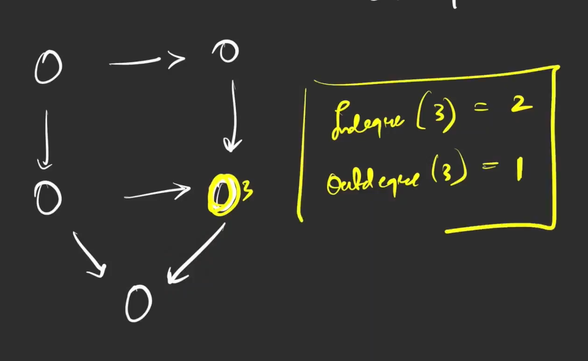
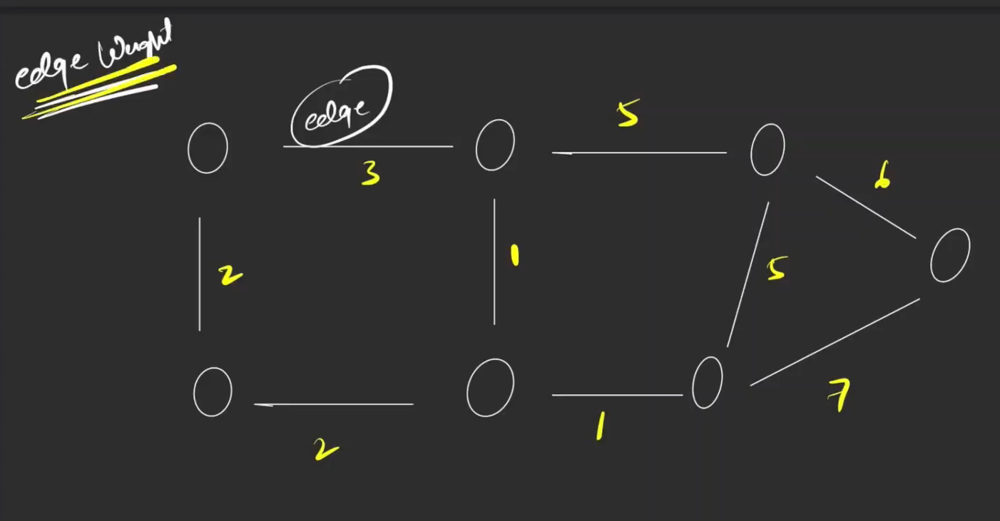

Directed graph v/s Undirected graph

## Cycles in a graph
> Binary tree can be also called as graph, as it have node and edges.

> Path -> It contains a lot of nodes and each of them are reachable.

Note -> a node cannot appear twice in a path.

## Degrees on graph
> the number of the edges that go inside or outside of the node total in ubdirected graph

### Property

Incase of directed graph -

## Edge Weight - 

> in case of weights are not assigned, unit weight are assigned to it ie 1

