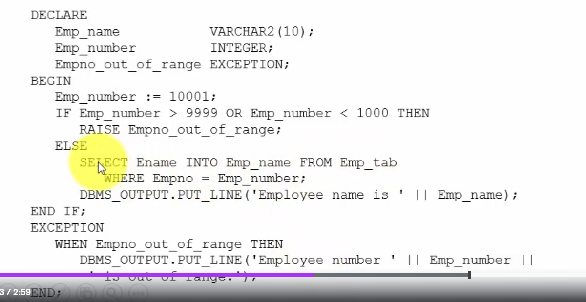
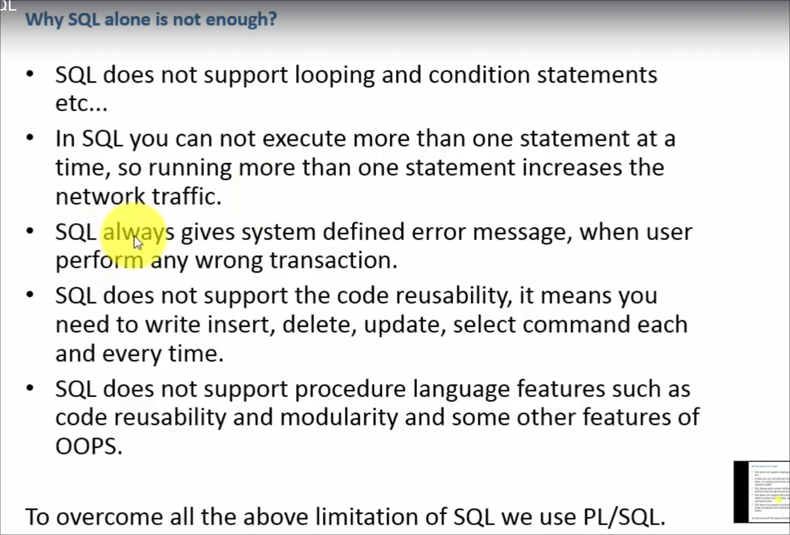
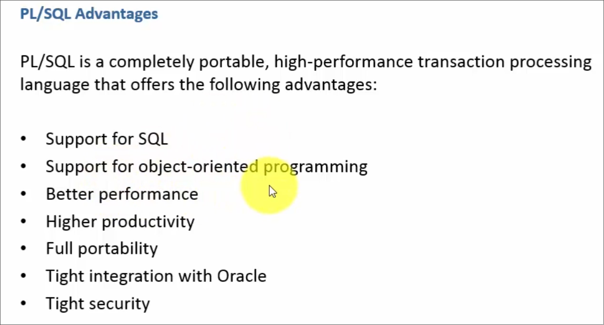
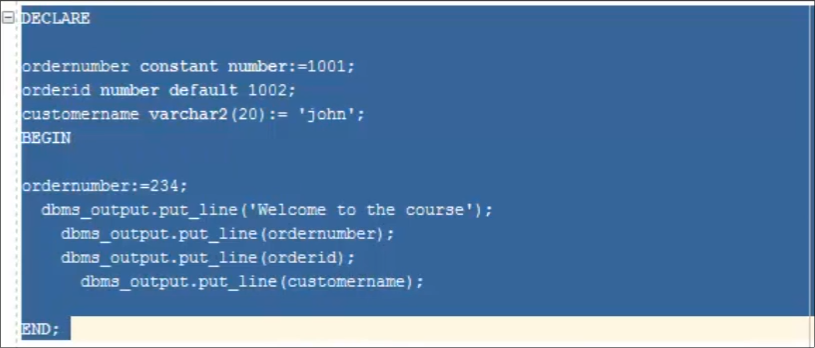

# PL/SQL

### What is PL/SQL?
- plsql is a procedural language extended to SQL
- plsql can have both sql statements ans procedural statements
    - sql statements are used to access the sets of data stored in the database
    - procedural statements are used to perform operations on the data
- procedural mean ordered statements that computer should follow to process the data and produce output

***
### PL/SQL Syntax



***
### Why sql isn't enough?
- it doesnt support loops and conditional statements
- doesnt offer code reusability
- in sql you cannot execute multiple statements at once



***
### plsql advantages -



***
### plsql structure -

```sql
DECLARE

    <declarations statements>
BEGIN

    <executable statements>

EXCEPTION

    <exception handling>

End;
```

***
### Ex- First Program 

```sql
DECLARE

BEGIN
	dbms_output.put_line('welcome to course');

END;
```

**Note** - dbms_output.put_line() is used to print the output on the screen

***

### Ex- Declaring a variable

>Structure 
```sql
DECLARE

var_nam datatype := value; -- ":=" is used to declare default value
-- or we can use this form
var_nam datatype default value;

BEGIN
    dbms_output.put_line(var_nam); -- to print the value

END;
```
**Note** - whatever value declared in the DECLARE block can be overridden in the BEGIN block, if you dont want BEGIN block to override the value use "constant".

>Example



```sql
DECLARE
ordernumber constant number := 1001;
awb constant number := 1071;
-- if you dont want BEGIN block to override the value use "constant"
orderid number default 1002;
cust_name varchar2(20) := 'John';
BEGIN
-- we can updaten the values
awb := 1003;   
dbms_output.put_line(ordernumber);
dbms_output.put_line(orderid);
dbms_output.put_line(cust_name);
dbms_output.put_line(awb); -- this will throw an error because awb is constant
END;
```