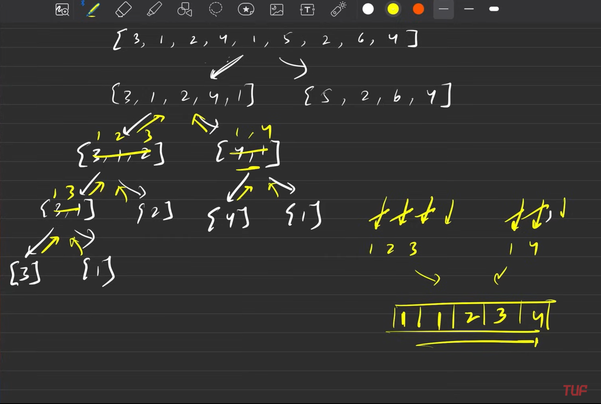
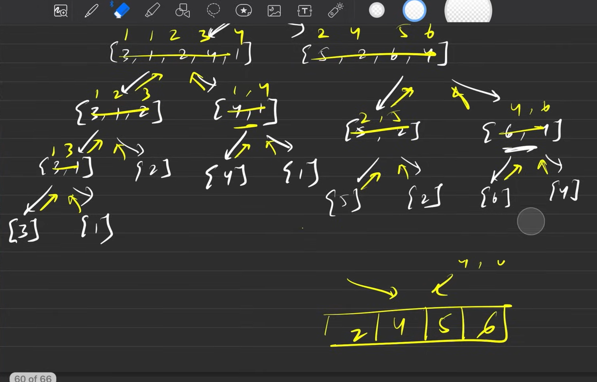
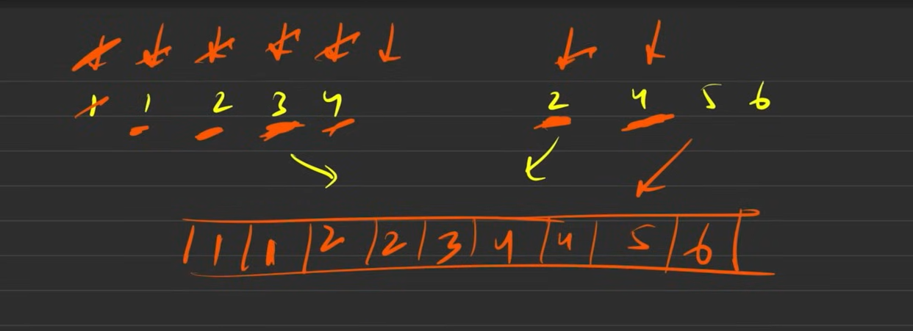
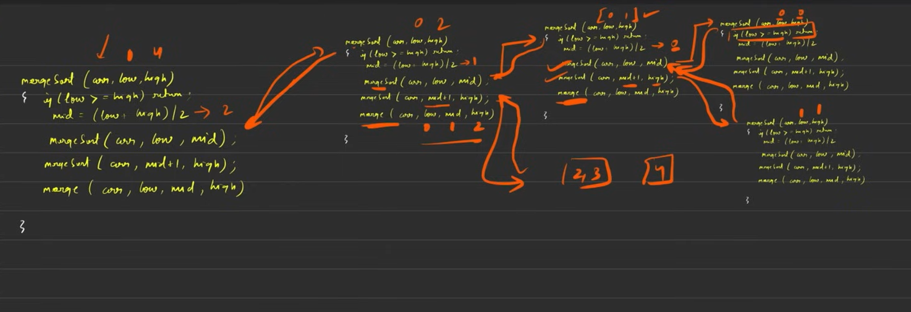
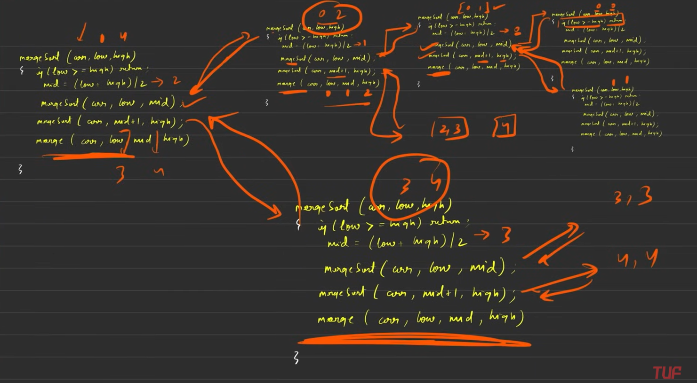

### Best way to present an algorithm is to show -

1. Explanation
2. Pseudocode
3. Dry Run
4. Complexity

---
>`Left Part`

>`Right Part`

Merging both parts

> Note - once we most past the pointers in the left or right part, we can simply add the remaining elements to the result since they are already sorted.

