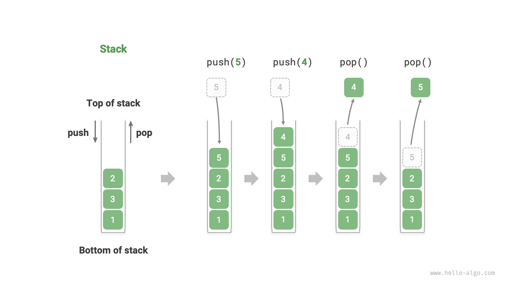

REF - https://www.hello-algo.com/en/chapter_stack_and_queue/

**Stack:**
A stack is a linear data structure that follows the Last-In-First-Out (LIFO) principle. It means that the element which is inserted last will be the first one to be removed. Think of it as a stack of plates, where you can only access the topmost plate.

Here's an example of a stack in Python:

```python
stack = []

# Pushing elements onto the stack
stack.append(1)
stack.append(2)
stack.append(3)

# Popping elements from the stack
print(stack.pop())  # Output: 3
print(stack.pop())  # Output: 2
print(stack.pop())  # Output: 1
```

**Queue:**
A queue is a linear data structure that follows the First-In-First-Out (FIFO) principle. It means that the element which is inserted first will be the first one to be removed. Think of it as a queue of people waiting in line, where the person who arrived first will be served first.

Here's an example of a queue in Python:

```python
from collections import deque

queue = deque()

# Enqueuing elements into the queue
queue.append(1)
queue.append(2)
queue.append(3)

# Dequeuing elements from the queue
print(queue.popleft())  # Output: 1
print(queue.popleft())  # Output: 2
print(queue.popleft())  # Output: 3
```

## Stack
A stack is a linear data structure that follows the principle of Last-In-First-Out (LIFO).




<p align="center"> <u> Table: <id> &nbsp; Efficiency of stack operations </p></u>

| Method   | Description                                     | Time Complexity |
| -------- | ----------------------------------------------- | --------------- |
| `push()` | Push an element onto the stack (add to the top) | $O(1)$          |
| `pop()`  | Pop the top element from the stack              | $O(1)$          |
| `peek()` | Access the top element of the stack             | $O(1)$          |


```java title="stack.java"
/* Initialize the stack */
Stack<Integer> stack = new Stack<>();

/* Push elements onto the stack */
stack.push(1);
stack.push(3);
stack.push(2);
stack.push(5);
stack.push(4);

/* Access the top element of the stack */
int peek = stack.peek();

/* Pop an element from the stack */
int pop = stack.pop();

/* Get the length of the stack */
int size = stack.size();

/* Check if the stack is empty */
boolean isEmpty = stack.isEmpty();
```

## Implementing a stack

To gain a deeper understanding of how a stack operates, let's try implementing a stack class ourselves.

A stack follows the principle of Last-In-First-Out, which means we can only add or remove elements at the top of the stack. However, both arrays and linked lists allow adding and removing elements at any position, **therefore a stack can be seen as a restricted array or linked list**. In other words, we can "shield" certain irrelevant operations of an array or linked list, aligning their external behavior with the characteristics of a stack.

### Implementation based on an array

When implementing a stack using an array, we can consider the end of the array as the top of the stack. As shown in the figure below, push and pop operations correspond to adding and removing elements at the end of the array, respectively, both with a time complexity of $O(1)$.

=== "ArrayStack"
    

=== "push()"
    

=== "pop()"
    

Since the elements to be pushed onto the stack may continuously increase, we can use a dynamic array, thus avoiding the need to handle array expansion ourselves. Here is an example code:

