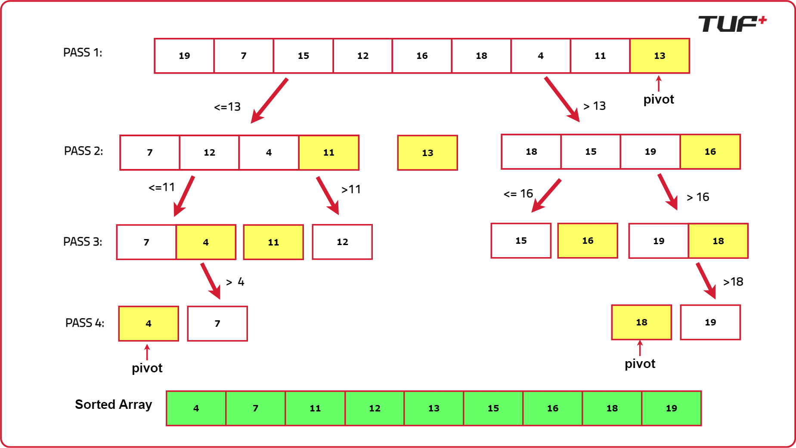

# Quick Sort
Quick sort is a sorting algorithm that uses divide and conquer approach. It is similar to merge sort, but it has a time complexity of O(n log n).

## Quick Sort Algorithm
- 🔍 **Purpose**: Sort data structures in ascending order
- 🔄 **Minor tweaks**: Adjustments can be made for sorting in descending order

## Lecture Flow
- 📝 **Explanation** of the algorithm
- 💡 **Intuition** behind each step
- 📜 **Pseudo code** writing
- 🧪 **Dry run** on the pseudo code
- 🔗 **Online compiler demonstration**
- ⏳ **Discussion** on time complexity and space complexity

## Understanding Quick Sort
- 📌 **Step 1**: Pick a pivot (any element)
- 📌 **Step 2**: Place smaller elements on the left, larger ones on the right
- 🔄 **Repeat** until sorted

## Implementation Details
- 📏 **Using pointers**: `low` and `high`
- 🔄 **Recursion**: For sorting left and right portions

## Complexity Analysis
- ⚙️ **Time complexity**: O(n log n)
- 📦 **Space complexity**: O(1) (not counting the recursion stack)

### Some Facts About Quick Sort
- The Unix `sort()` utility uses Quick sort.
- Quick sort is an in-place sorting algorithm, so its space complexity is O(1).
- Quick sort is not stable, meaning it does not preserve the order of equal elements.

****

**Picking Pivot Element**
- The pivot element can be chosen in various ways:
    - First element
    - Last element
    - Middle element
    - Random element
- Regardless of the choice, the pivot will always be placed in the correct position in the sorted array.

**Intuition**
1. Pick a pivot element and place it in its correct position in the sorted array.
2. Place smaller elements on the left and larger elements on the right.
3. Repeat the process until the array is sorted.

**Dry Run**



**Approach**

To implement Quick Sort, we will create two functions: `quickSort()` and `partition()`.

1. **`quickSort(arr[], low, high)`**
   - **Initial Setup**: The `low` pointer points to the first index, and the `high` pointer points to the last index of the array.
   - **Partitioning**: Use the `partition()` function to get the index where the pivot should be placed after sorting. This index, called the partition index, separates the left and right unsorted subarrays.
   - **Recursive Calls**: After placing the pivot at the partition index, recursively call `quickSort()` for the left and right subarrays. The range of the left subarray will be `[low to partition index - 1]` and the range of the right subarray will be `[partition index + 1 to high]`.
   - **Base Case**: The recursion continues until the range becomes 1.

2. **`partition(arr[], low, high)`**
   - Select a pivot (e.g., `arr[low]`).
   - Use pointers `i` (starting from `low`) and `j` (starting from `high`). Move `i` forward to find an element greater than the pivot, and `j` backward to find an element smaller than the pivot. Ensure `i <= high - 1` and `j >= low + 1`.
   - If `i < j`, swap `arr[i]` and `arr[j]`.
   - Continue until `j < i`.
   - Swap the pivot (`arr[low]`) with `arr[j]` and return `j` as the partition index.

**Pseudo Code**

```cpp
function quickSort(arr[], low, high) {
    if (low >= high) {
        return
    }
    
    partitionIndex = partition(arr[], low, high)
    
    quickSort(arr[], low, partitionIndex - 1)
    quickSort(arr[], partitionIndex + 1, high)
}

function partition(arr[], low, high) {
    pivot = arr[low]
    i = low
    j = high
    
    while (i < j) {
        while (arr[i] <= pivot and i < high) {
            i++
        }
        
        while (arr[j] > pivot) {
            j--
        }
        
        if (i < j) {
            swap(arr[i], arr[j])
        }
    }
    
    swap(arr[low], arr[j])
    return j
}

```

## References and Credits

🎓 [Striver's](https://www.youtube.com/watch?v=WIrA4YexLRQ) Awesome Videos for detailed explanations and tutorials.

🌐 [Hello Algorithm](https://www.hello-algo.com/en/chapter_sorting/quick_sort/#1153-why-is-quick-sort-fast) for insightful content and examples.